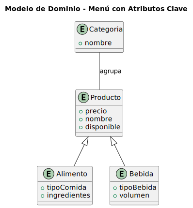

# Modelo de Dominio - Menú

Este repositorio contiene el modelo de dominio para el concepto **Menú**, representando la estructura de menús, categorías y productos en un sistema de restaurante.

## Diagrama UML

El diagrama UML está disponible en formato **SVG**:

## Entidades Principales

- **Categoría**: Agrupa productos dentro de un menú, por ejemplo “Entradas” o “Postres”.  
- **Producto**: Elemento genérico del menú, con nombre, descripción y precio.
- **Alimento**: Producto alimenticio, incluye tipo de comida e ingredientes.  
- **Bebida**

