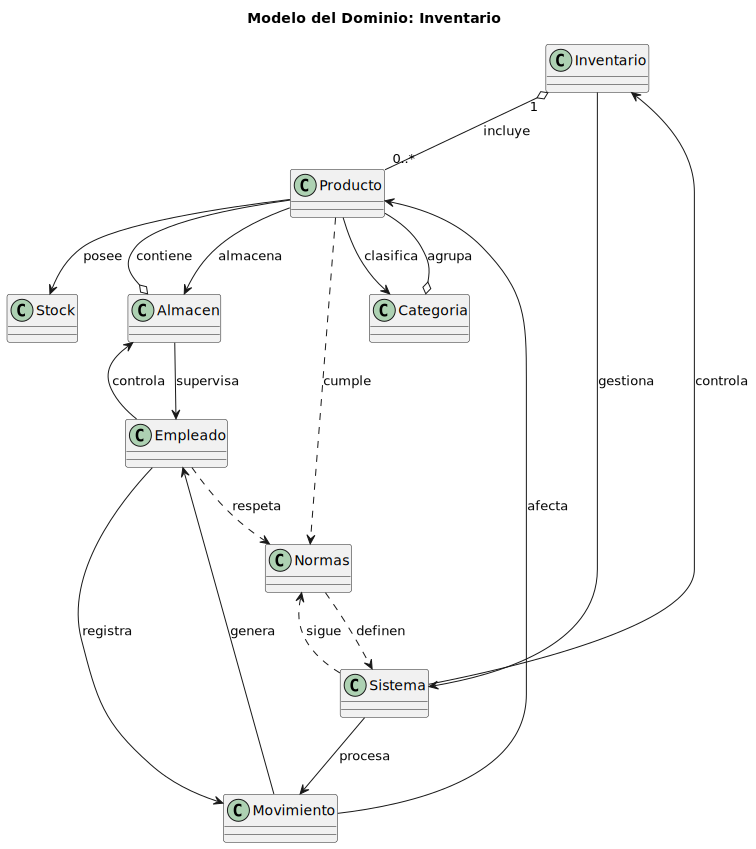

#  Modelo del Dominio: Inventario

Este modelo representa los conceptos principales y relaciones dentro del **sistema de gestión de inventario**.  
Se basa en un enfoque orientado a objetos, donde cada entidad (clase) representa un componente del dominio, y las flechas indican las relaciones entre ellas.

---

## 📘 Entidades Principales

### **Inventario**
- Representa el conjunto general de productos que se gestionan.
- Se compone de varios **Productos**.
- Es gestionado por un **Sistema**.

### **Producto**
- Unidad básica del inventario.
- Cada producto pertenece a una **Categoría**, se almacena en un **Almacén**, posee un **Stock**, y debe cumplir ciertas **Normas**.

### **Categoría**
- Agrupa productos con características similares (por tipo, función o naturaleza).

### **Almacén**
- Lugar físico o lógico donde se almacenan los productos.
- Contiene varios **Productos** y es **supervisado por un Empleado**.

### **Empleado**
- Persona encargada de supervisar el **Almacén**, registrar **Movimientos** y garantizar el cumplimiento de **Normas**.

### **Sistema**
- Software o módulo encargado de gestionar el **Inventario**, procesar **Movimientos** y aplicar las **Normas** definidas.

### **Movimiento**
- Representa una acción que afecta el inventario, como una **entrada** o **salida** de productos.
- Es generado por un **Empleado** y afecta a un **Producto**.

### **Stock**
- Indica la cantidad disponible de un **Producto** en el inventario.

### **Normas**
- Conjunto de reglas o políticas que deben seguir tanto el **Sistema** como los **Empleados**.
- Aseguran la coherencia y la correcta gestión del inventario.

---

## 🧭 Relaciones principales y significado

| Relación | Etiqueta | Descripción |
|-----------|-----------|-------------|
| `Inventario o-- Producto` | **incluye** | Un inventario incluye varios productos. |
| `Inventario --> Sistema` | **gestiona** | El sistema gestiona el inventario. |
| `Producto --> Categoria` | **clasifica** | Cada producto pertenece a una categoría. |
| `Producto --> Almacen` | **almacena** | El producto se almacena en un almacén. |
| `Producto --> Stock` | **posee** | El producto tiene un stock asociado. |
| `Producto ..> Normas` | **cumple** | El producto cumple ciertas normas. |
| `Almacen o-- Producto` | **contiene** | Un almacén contiene productos. |
| `Almacen --> Empleado` | **supervisa** | El almacén es supervisado por un empleado. |
| `Empleado --> Almacen` | **controla** | El empleado controla el almacén. |
| `Empleado --> Movimiento` | **registra** | El empleado registra los movimientos. |
| `Empleado ..> Normas` | **respeta** | El empleado debe respetar las normas. |
| `Sistema --> Inventario` | **controla** | El sistema controla el inventario. |
| `Sistema --> Movimiento` | **procesa** | El sistema procesa los movimientos. |
| `Sistema ..> Normas` | **sigue** | El sistema sigue las normas. |
| `Movimiento --> Producto` | **afecta** | Un movimiento afecta un producto. |
| `Movimiento --> Empleado` | **genera** | El movimiento es generado por un empleado. |
| `Categoria o-- Producto` | **agrupa** | Una categoría agrupa productos. |
| `Normas ..> Sistema` | **definen** | Las normas definen políticas para el sistema. |

---

## 🧠 Interpretación General

El **Inventario** centraliza todos los **Productos**, que están organizados por **Categorías** y almacenados en **Almacenes**.  
Los **Empleados** gestionan los **Movimientos** (entradas o salidas), mientras el **Sistema** automatiza el control y seguimiento de las **Normas** establecidas.  

---

## 📄 Diagrama UML

