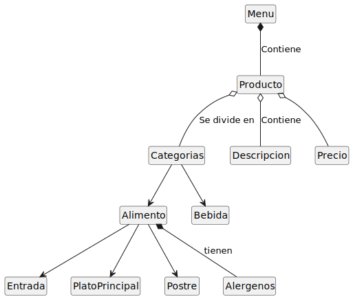

# Diagrama de Relacion de Menu

~~~~~
@startuml

hide empty members
hide circle

class Menu

class Producto

class Categorias

class Descripcion

class Precio

class Entrada

class PlatoPrincipal

class Postre

class Alimento

class Bebida

class Alergenos

Menu *-- Producto: Contiene

Producto o-- Descripcion: Contiene
Producto o-- Categorias: Se divide en
Producto o-- Precio

Categorias --> Alimento
Categorias --> Bebida

Alimento --> Entrada
Alimento --> PlatoPrincipal 
Alimento --> Postre
Alimento *-- Alergenos: tienen

@enduml