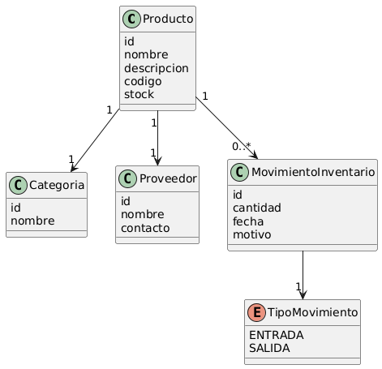

# Inventario – Planteación

## ¿Qué hace un inventario?

Un inventario sirve para llevar un control de productos, artículos u objetos, permitiendo saber **qué hay**, **cuánto hay** y **cómo ha cambiado** ese stock con el tiempo.

## ¿Qué tiene un inventario?

Las entidades principales que identifiqué son:

- **Producto**: El artículo que se gestiona como por ejejmplo: laptop, cuaderno, tornillo.
- **Categoría**: Agrupa productos por tipo como por ejemplo: electrónica, papelería, ferretería.
- **Proveedor**: Quién suministra los productos al inventario.
- **Inventario (o Stock)**: Registro de la cantidad actual disponible de un producto.
- **Movimiento de Inventario**: Registra cada cambio en el stock:
  - **Estado Entradas**: cuando llega mercancía (compra, devolución).
  - **Estado Salidas**: cuando se vende o se usa material.

### 1er - Modelo del Dominio 

